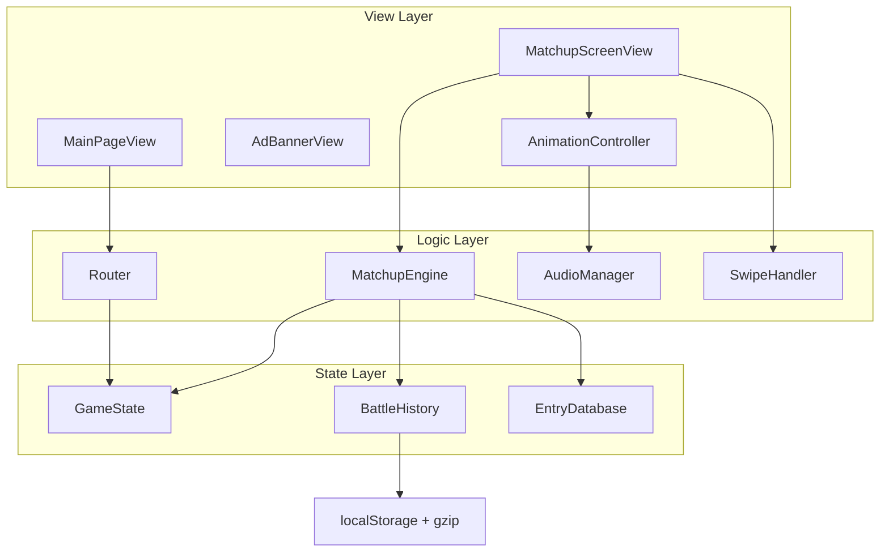

# Design Document: One Battle After Another

## Overview

"One Battle After Another" is a mobile-optimized, single-page web game where players select arenas from a grid and vote on head-to-head matchups. The game uses a "king of the hill" loop: two entries appear side-by-side with cropped images, the player picks a winner via tap or swipe-reveal, the winner stays, and a new contender fades in. Battle results persist in localStorage with gzip compression, and matchup pairs are never repeated within an arena.

### Technology Stack

- **Language**: TypeScript
- **Bundler**: Vite
- **UI**: Vanilla TypeScript with DOM manipulation (no framework — the app is small, animation-heavy, and benefits from direct DOM/CSS control)
- **Styling**: CSS3 with CSS custom properties for theming
- **Animations**: CSS transitions + `requestAnimationFrame` for swipe tracking
- **Audio**: Web Audio API for low-latency sound effects
- **Compression**: CompressionStream/DecompressionStream API (native browser gzip)
- **Testing**: Vitest + fast-check (property-based testing)

### Design Rationale

A vanilla TS approach avoids framework overhead for a game that is fundamentally about touch gestures, animations, and state transitions. Vite provides fast HMR during development and optimized production builds. The Web Audio API gives sub-frame latency for sound effects, which matters for responsive tap/swipe feedback.

## Architecture

The application follows a simple layered architecture with three layers: **State**, **Logic**, and **View**.



### Layer Responsibilities

**State Layer** — Pure data. No DOM access. Serializable.
- `GameState`: Current screen, selected arena, current matchup entries, winner
- `BattleHistory`: All battle results, compressed persistence, matchup-pair lookup
- `EntryDatabase`: Static arena/entry data, lookup by arena

**Logic Layer** — Orchestration. No DOM access. Testable in isolation.
- `Router`: Hash-based navigation between main page and matchup screen
- `MatchupEngine`: Picks entries, validates uniqueness against history, determines winner, manages the king-of-the-hill loop
- `SwipeHandler`: Touch event processing, distance calculation, threshold detection
- `AudioManager`: Loads and plays sound effect buffers via Web Audio API

**View Layer** — DOM rendering. Reads state, writes DOM. Thin.
- `MainPageView`: Renders title, arena grid, handles arena button clicks
- `MatchupScreenView`: Renders matchup header, entry images, name labels; delegates gestures to SwipeHandler
- `AdBannerView`: Fixed-bottom ad banner on all screens
- `AnimationController`: Coordinates CSS class toggling and `requestAnimationFrame` sequences for transitions


## Components and Interfaces

### Router

```typescript
interface Route {
  screen: "main" | "matchup";
  arenaId?: string;
}

class Router {
  navigate(route: Route): void;
  getCurrentRoute(): Route;
  onRouteChange(callback: (route: Route) => void): void;
}
```

Hash-based routing (`#/` for main, `#/arena/{arenaId}` for matchup). No external router library needed.

### EntryDatabase

```typescript
interface Entry {
  name: string;
  imageUrl: string;
}

interface Arena {
  id: string;
  name: string;
  battleground: string;
  entries: Entry[];
}

interface Battleground {
  name: string;
  arenas: Arena[];
}

class EntryDatabase {
  getAllArenas(): Arena[];
  getArena(arenaId: string): Arena | undefined;
  getEntries(arenaId: string): Entry[];
}
```

Static data module exporting predefined battlegrounds. Adding a new arena means adding an object to the data array — no layout logic changes needed (Requirement 3.4).

### MatchupEngine

```typescript
interface MatchupPick {
  optionA: Entry;
  optionB: Entry;
}

class MatchupEngine {
  /** Pick two entries that haven't been matched before in this arena */
  pickInitialMatchup(arenaId: string): MatchupPick | null;

  /** Pick a new contender for the winner, excluding already-seen pairs */
  pickNextContender(arenaId: string, winner: Entry): Entry | null;

  /** Record a battle result and return whether more matchups are available */
  recordResult(arenaId: string, optionA: Entry, optionB: Entry, winner: Entry): boolean;

  /** Check if a matchup pair already exists in history */
  isPairPlayed(arenaId: string, entryA: string, entryB: string): boolean;

  /** Check if all possible pairs in an arena are exhausted */
  isArenaExhausted(arenaId: string): boolean;
}
```

The engine uses `BattleHistory` to filter out played pairs. A matchup pair is identified by sorting the two entry names alphabetically and joining them — this ensures "A vs B" and "B vs A" are the same pair.

### BattleHistory

```typescript
interface BattleResult {
  arenaId: string;
  entryA: string;
  entryB: string;
  winner: string;
  timestamp: number;
}

class BattleHistory {
  addResult(result: BattleResult): void;
  getResults(arenaId?: string): BattleResult[];
  getPlayedPairs(arenaId: string): Set<string>;
  save(): Promise<void>;
  load(): Promise<void>;
  clear(): void;
}
```

Persistence uses `CompressionStream` with gzip → Base64 for localStorage. The `getPlayedPairs` method returns a `Set<string>` where each string is a canonical pair key (`"entryA|entryB"` with names sorted).

### SwipeHandler

```typescript
interface SwipeState {
  active: boolean;
  direction: "left" | "right" | null;
  /** 0 to 1, representing how much of the cropped portion is revealed */
  revealProgress: number;
  startX: number;
  currentX: number;
}

class SwipeHandler {
  attach(element: HTMLElement): void;
  detach(): void;
  onSwipeUpdate(callback: (state: SwipeState) => void): void;
  onSwipeComplete(callback: (direction: "left" | "right") => void): void;
  onSwipeCancel(callback: () => void): void;
  getRevealPercent(swipeDistance: number, containerWidth: number): number;
}
```

Touch events (`touchstart`, `touchmove`, `touchend`) drive the swipe. The reveal progress maps swipe distance to the 0–25% cropped range. At 90% total visibility (i.e., `revealProgress >= 0.6` of the cropped 25%, meaning 75% + 15% = 90%), auto-select fires. On release below threshold, a CSS transition snaps back.

**Reveal calculation**: The image starts at 75% visible. The cropped 25% is the revealable range. `revealProgress` goes from 0 (75% visible) to 1 (100% visible). The reveal threshold fires at `revealProgress >= 0.6` because 75% + (25% × 0.6) = 90%.

### AudioManager

```typescript
type SoundEffect = "tap" | "swipe" | "transition" | "contenderAppear";

class AudioManager {
  loadSounds(): Promise<void>;
  play(effect: SoundEffect): void;
  setMuted(muted: boolean): void;
}
```

Uses Web Audio API with pre-decoded `AudioBuffer` objects for instant playback. Sound files are small WAV/MP3 assets bundled with the app.

### AnimationController

```typescript
class AnimationController {
  /** Highlight the selected option with a pulse/glow */
  playSelectionHighlight(element: HTMLElement): Promise<void>;

  /** Animate loser sliding off-screen */
  playLoserExit(element: HTMLElement, direction: "left" | "right"): Promise<void>;

  /** Animate winner sliding to opposite side */
  playWinnerSlide(element: HTMLElement, from: "left" | "right"): Promise<void>;

  /** Fade in new contender */
  playContenderEntrance(element: HTMLElement): Promise<void>;

  /** Snap-back animation for cancelled swipe */
  playSnapBack(element: HTMLElement): Promise<void>;
}
```

All animations return Promises so they can be sequenced. Implementation uses CSS classes with `transitionend`/`animationend` event listeners. The 30+ fps requirement is met by using CSS transforms (GPU-accelerated) rather than layout-triggering properties.

### View Components

```typescript
class MainPageView {
  render(arenas: Arena[]): void;
  onArenaSelect(callback: (arenaId: string) => void): void;
}

class MatchupScreenView {
  render(battleground: string, arena: string, optionA: Entry, optionB: Entry): void;
  updateReveal(direction: "left" | "right", progress: number): void;
  showExhaustedMessage(message: string): void;
  onOptionTap(callback: (option: "a" | "b") => void): void;
}

class AdBannerView {
  render(container: HTMLElement): void;
}
```


## Data Models

### Static Data: Battlegrounds and Entries

```typescript
// data/battlegrounds.ts
const battlegrounds: Battleground[] = [
  {
    name: "Music",
    arenas: [
      {
        id: "albums",
        name: "Albums",
        battleground: "Music",
        entries: [
          { name: "Thriller", imageUrl: "https://upload.wikimedia.org/..." },
          { name: "Abbey Road", imageUrl: "https://upload.wikimedia.org/..." },
          // ... minimum 10 entries
        ]
      },
      {
        id: "bands",
        name: "Bands",
        battleground: "Music",
        entries: [/* ... */]
      },
      {
        id: "singers",
        name: "Singers",
        battleground: "Music",
        entries: [/* ... */]
      }
    ]
  },
  {
    name: "Movie",
    arenas: [
      { id: "films", name: "Films", battleground: "Movie", entries: [/* ... */] },
      { id: "actors", name: "Actors", battleground: "Movie", entries: [/* ... */] },
      { id: "actresses", name: "Actresses", battleground: "Movie", entries: [/* ... */] }
    ]
  }
];
```

Adding a new battleground or arena is a data-only change. The `EntryDatabase` class iterates all battlegrounds to build the flat arena list for the grid.

### Persisted Data: Battle History

```typescript
// Stored in localStorage under key "battleHistory"
// Format: Base64-encoded gzip of JSON

interface PersistedBattleHistory {
  version: 1;
  results: BattleResult[];
}

// BattleResult (repeated from above for clarity)
interface BattleResult {
  arenaId: string;
  entryA: string;   // alphabetically first of the pair
  entryB: string;   // alphabetically second of the pair
  winner: string;
  timestamp: number; // Date.now()
}
```

**Canonical pair key**: `entryA` and `entryB` are always stored in alphabetical order. This ensures `isPairPlayed("Tom Hanks", "Brad Pitt")` and `isPairPlayed("Brad Pitt", "Tom Hanks")` both resolve to the same key `"Brad Pitt|Tom Hanks"`.

### Compression/Decompression Flow

```mermaid
graph LR
    A[BattleResult[]] -->|JSON.stringify| B[JSON string]
    B -->|CompressionStream gzip| C[Uint8Array]
    C -->|Base64 encode| D[localStorage string]
    D -->|Base64 decode| E[Uint8Array]
    E -->|DecompressionStream gzip| F[JSON string]
    F -->|JSON.parse| G[BattleResult[]]
```

### Matchup Pair Exhaustion Calculation

For an arena with `n` entries, the total possible unique pairs is `n × (n-1) / 2`. With a minimum of 10 entries per arena, that's at least 45 unique matchups. The `MatchupEngine` tracks this count per arena to detect exhaustion (Requirements 16.5, 16.6).

### Application State

```typescript
interface GameState {
  currentScreen: "main" | "matchup";
  selectedArenaId: string | null;
  currentMatchup: {
    optionA: Entry;
    optionB: Entry;
  } | null;
  winner: Entry | null;
  isTransitioning: boolean;
}
```

State is held in memory (not persisted). Only `BattleHistory` survives page reloads.

### CSS Image Cropping Model

Each option image is rendered in a container using `overflow: hidden`. The image is sized at ~133% of the container width (so 25% overflows). Positioning:

- **Option A (left)**: Image shifted left by 25% of its width → left edge is off-screen, right 75% visible
- **Option B (right)**: Image at default position → left 75% visible, right edge is off-screen

During swipe reveal, a CSS `transform: translateX()` progressively shifts the image to reveal the cropped portion. This uses GPU-composited transforms for smooth 30+ fps animation.

```css
.option-image-container {
  overflow: hidden;
  width: 50%; /* half the screen */
}

.option-image {
  width: 133.33%; /* 100% / 0.75 */
  transition: transform 0.3s ease-out; /* for snap-back */
}

.option-a .option-image {
  transform: translateX(-25%); /* crop left 25% */
}

.option-b .option-image {
  transform: translateX(0%); /* crop right 25% (overflow hidden handles it) */
}
```


## Correctness Properties

*A property is a characteristic or behavior that should hold true across all valid executions of a system — essentially, a formal statement about what the system should do. Properties serve as the bridge between human-readable specifications and machine-verifiable correctness guarantees.*

### Property 1: Arena grid completeness

*For any* set of battlegrounds and arenas in the EntryDatabase, the rendered arena grid should contain exactly one button per arena, each labeled with the arena's name, with no battleground category headers present.

**Validates: Requirements 1.3, 2.1, 2.2, 2.3, 3.4**

### Property 2: Matchup header format

*For any* arena with a battleground name and arena name, the matchup screen header should equal the string `"{battlegroundName} > {arenaName}"`.

**Validates: Requirements 7.1**

### Property 3: Picked entries belong to arena

*For any* arena, both entries in a newly picked matchup should be members of that arena's entry database.

**Validates: Requirements 7.2**

### Property 4: Tap selects the tapped option

*For any* matchup with Option A and Option B, tapping Option A should set the winner to Option A, and tapping Option B should set the winner to Option B.

**Validates: Requirements 9.1, 9.2**

### Property 5: Swipe reveal is proportional to distance

*For any* non-negative swipe distance and positive container width, the reveal progress should equal `clamp(swipeDistance / (containerWidth * 0.25), 0, 1)`, and the total image visibility should equal `0.75 + 0.25 * revealProgress`.

**Validates: Requirements 10.1, 10.2**

### Property 6: Reveal threshold triggers selection or snap-back

*For any* reveal progress value, if total visibility (75% + 25% × revealProgress) is ≥ 90%, the system should trigger auto-selection; otherwise, releasing should trigger snap-back to the 75% visible state.

**Validates: Requirements 10.4, 10.5**

### Property 7: Sound effects are triggered for game events

*For any* game event in the set {tap-select, swipe, transition, contender-appear}, the AudioManager should receive a play call with the corresponding sound effect type.

**Validates: Requirements 9.3, 10.6, 11.6, 13.1, 13.2, 13.3, 13.4**

### Property 8: New matchup pairs are never repeated

*For any* arena and battle history, a newly picked matchup pair (whether initial or contender) should not exist as a played pair in the battle history for that arena. The pair comparison should be order-independent (A vs B = B vs A).

**Validates: Requirements 12.5, 16.1, 16.2, 16.4**

### Property 9: Contender excludes current winner

*For any* arena, winner entry, and battle history, the picked contender should not be the same entry as the current winner, and should be a member of the arena's entry database.

**Validates: Requirements 11.4**

### Property 10: Entry database integrity

*For any* arena in the EntryDatabase, it should contain at least 10 entries, and every entry should have a non-empty name and a valid Wikipedia image URL (containing "wikipedia.org" or "wikimedia.org").

**Validates: Requirements 12.1, 12.2, 12.3**

### Property 11: Battle result completeness

*For any* matchup outcome (arena, optionA, optionB, winner), the created BattleResult should contain the arena identifier, both entry names in alphabetical order, the winner name, and a numeric timestamp. After creation, the result should appear in the battle history.

**Validates: Requirements 15.1, 15.2, 16.3**

### Property 12: Battle history compression round-trip

*For any* valid list of BattleResults, compressing to gzip+Base64 and then decompressing back should produce a list equal to the original.

**Validates: Requirements 15.3, 15.4, 15.5**

### Property 13: Winner exhaustion detection

*For any* arena with `n` entries and a winner entry, if the battle history contains `n - 1` played pairs involving the winner (one for each other entry), then `pickNextContender` should return null.

**Validates: Requirements 16.5**

### Property 14: Arena exhaustion detection

*For any* arena with `n` entries, if the battle history contains all `n × (n-1) / 2` possible pairs for that arena, then `isArenaExhausted` should return true and `pickInitialMatchup` should return null.

**Validates: Requirements 16.6**

### Property 15: Image crop offset calculation

*For any* option side ("left" or "right") and image width, the initial CSS transform should offset the image by exactly 25% of its width in the appropriate direction, leaving exactly 75% visible within the container.

**Validates: Requirements 8.1, 8.2, 8.3**


## Error Handling

### localStorage Unavailable or Corrupted

- On load, if `localStorage.getItem("battleHistory")` returns null, initialize empty history (normal first-run).
- If the stored value fails Base64 decoding, gzip decompression, or JSON parsing, log a warning and initialize empty history. Do not crash. (Requirement 15.6)
- If `localStorage.setItem` throws (quota exceeded, private browsing), catch the error, log a warning, and continue with in-memory-only history. The game remains playable but results won't persist across sessions.

### CompressionStream API Unavailable

- Some older browsers lack `CompressionStream`. Detect support at startup.
- Fallback: store raw JSON in localStorage without compression. The `BattleHistory` class abstracts this — callers don't know the storage format.

### Entry Database Errors

- If an arena has fewer than 2 entries (data error), skip it in the grid and log a warning.
- If an image URL fails to load, display a placeholder image (colored rectangle with the entry name).

### Matchup Exhaustion

- When `pickNextContender` returns null (all pairs for the winner are played), display a message: "No more matchups for {winnerName}!" and navigate back to the main page after a short delay.
- When `pickInitialMatchup` returns null (all arena pairs exhausted), display: "All matchups complete in {arenaName}!" and navigate back.

### Audio Errors

- If Web Audio API is unavailable or audio files fail to load, the game continues silently. Sound effects are non-critical.
- `AudioManager.play()` catches and swallows errors internally.

## Testing Strategy

### Unit Tests (Vitest)

Unit tests cover specific examples, edge cases, and integration points:

- **Main page rendering**: Verify header text is "One Battle After Another", sub-header is "Pick a Battleground", ad banner shows "Advertisement" (Requirements 1.1, 1.2, 1.4, 6.4)
- **Predefined data**: Verify Music battleground has Albums/Bands/Singers, Movie has Films/Actors/Actresses (Requirements 3.1, 3.2)
- **Ad banner presence**: Verify banner renders on both main page and matchup screen (Requirements 6.1, 6.2)
- **Corrupted localStorage**: Verify graceful fallback to empty history with various corrupted inputs (Requirement 15.6)
- **Arena navigation**: Verify tapping an arena button triggers route change (Requirement 4.1)
- **Transition state reset**: Verify images reset to 25% crop after transition completes (Requirement 11.5)

### Property-Based Tests (Vitest + fast-check)

Each property test runs a minimum of 100 iterations with randomly generated inputs. Each test is tagged with a comment referencing its design property.

- **Property 1 test**: Generate random lists of arenas, render the grid, assert button count equals arena count and labels match names.
  Tag: `// Feature: one-battle-after-another, Property 1: Arena grid completeness`

- **Property 2 test**: Generate random battleground/arena name pairs, assert header format matches `"{bg} > {arena}"`.
  Tag: `// Feature: one-battle-after-another, Property 2: Matchup header format`

- **Property 3 test**: Generate random arena databases, call `pickInitialMatchup`, assert both entries are in the arena.
  Tag: `// Feature: one-battle-after-another, Property 3: Picked entries belong to arena`

- **Property 4 test**: Generate random matchups, simulate tap on each option, assert winner matches tapped option.
  Tag: `// Feature: one-battle-after-another, Property 4: Tap selects the tapped option`

- **Property 5 test**: Generate random swipe distances and container widths, assert reveal progress matches the formula.
  Tag: `// Feature: one-battle-after-another, Property 5: Swipe reveal is proportional to distance`

- **Property 6 test**: Generate random reveal progress values, assert threshold detection matches the 90% rule.
  Tag: `// Feature: one-battle-after-another, Property 6: Reveal threshold triggers selection or snap-back`

- **Property 7 test**: Generate random game event sequences, assert each event triggers the correct AudioManager.play call.
  Tag: `// Feature: one-battle-after-another, Property 7: Sound effects are triggered for game events`

- **Property 8 test**: Generate random arenas with histories containing some played pairs, call pick functions, assert returned pairs are not in history.
  Tag: `// Feature: one-battle-after-another, Property 8: New matchup pairs are never repeated`

- **Property 9 test**: Generate random arenas with a winner, call `pickNextContender`, assert contender is not the winner and is in the arena database.
  Tag: `// Feature: one-battle-after-another, Property 9: Contender excludes current winner`

- **Property 10 test**: Iterate all arenas in the database, assert each has ≥ 10 entries with non-empty names and Wikipedia URLs.
  Tag: `// Feature: one-battle-after-another, Property 10: Entry database integrity`

- **Property 11 test**: Generate random matchup outcomes, call `recordResult`, assert the result appears in history with all required fields.
  Tag: `// Feature: one-battle-after-another, Property 11: Battle result completeness`

- **Property 12 test**: Generate random lists of BattleResults, compress then decompress, assert equality.
  Tag: `// Feature: one-battle-after-another, Property 12: Battle history compression round-trip`

- **Property 13 test**: Generate arenas with n entries, fill history with n-1 pairs for a specific winner, assert `pickNextContender` returns null.
  Tag: `// Feature: one-battle-after-another, Property 13: Winner exhaustion detection`

- **Property 14 test**: Generate arenas with n entries, fill history with all n*(n-1)/2 pairs, assert `isArenaExhausted` returns true.
  Tag: `// Feature: one-battle-after-another, Property 14: Arena exhaustion detection`

- **Property 15 test**: Generate random image widths and option sides, assert the crop offset equals 25% of image width in the correct direction.
  Tag: `// Feature: one-battle-after-another, Property 15: Image crop offset calculation`

### Testing Libraries

- **Vitest**: Test runner and assertion library
- **fast-check**: Property-based testing library for generating random inputs
- **jsdom**: DOM environment for view component tests (Vitest built-in)

### Test Configuration

Each property-based test must:
1. Run a minimum of 100 iterations (`fc.assert(property, { numRuns: 100 })`)
2. Include a tag comment referencing the design property number and title
3. Be implemented as a single property-based test per correctness property
